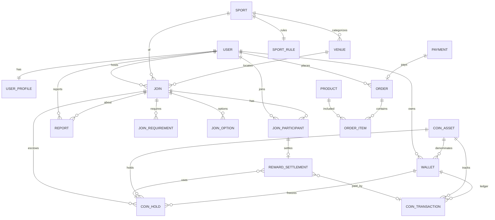

# ERD (1차 초안)

```mermaid
erDiagram
  USER ||--|| USER_PROFILE : has
  USER ||--o{ JOIN : hosts
  USER ||--o{ JOIN_PARTICIPANT : joins
  USER ||--o{ WALLET : owns
  USER ||--o{ REPORT : reports

  SPORT ||--o{ VENUE : categorizes
  SPORT ||--o{ JOIN : of
  SPORT ||--|| SPORT_RULE : rules

  VENUE ||--o{ JOIN : locates

  JOIN ||--o{ JOIN_REQUIREMENT : requires
  JOIN ||--o{ JOIN_OPTION : options
  JOIN ||--o{ JOIN_PARTICIPANT : has
  JOIN ||--o{ COIN_HOLD : escrows
  JOIN ||--o{ REPORT : about

  JOIN_PARTICIPANT ||--o| REWARD_SETTLEMENT : settles
  REWARD_SETTLEMENT }o--|| COIN_HOLD : uses
  REWARD_SETTLEMENT }o--o| COIN_TRANSACTION : paid_by

  COIN_ASSET ||--o{ WALLET : denominates
  COIN_ASSET ||--o{ COIN_TRANSACTION : tracks
  COIN_ASSET ||--o{ COIN_HOLD : holds

  WALLET ||--o{ COIN_TRANSACTION : ledger
  WALLET ||--o{ COIN_HOLD : freezes

  USER ||--o{ ORDER : places
  PRODUCT ||--o{ ORDER_ITEM : included
  ORDER ||--o{ ORDER_ITEM : contains
  PAYMENT ||--o| ORDER : pays
```

상세 컬럼·인덱스: [../domain-model.md](../domain-model.md)
